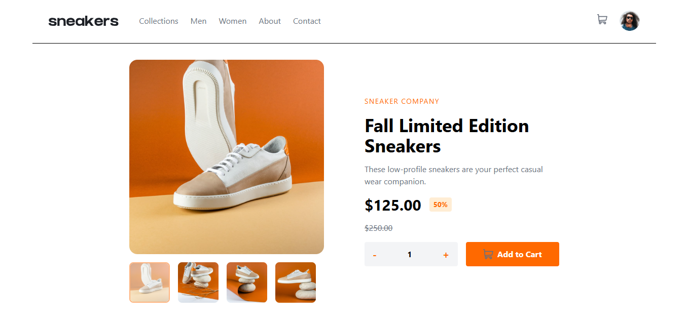
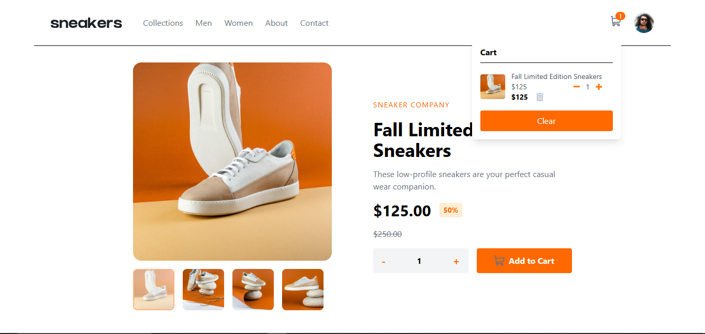
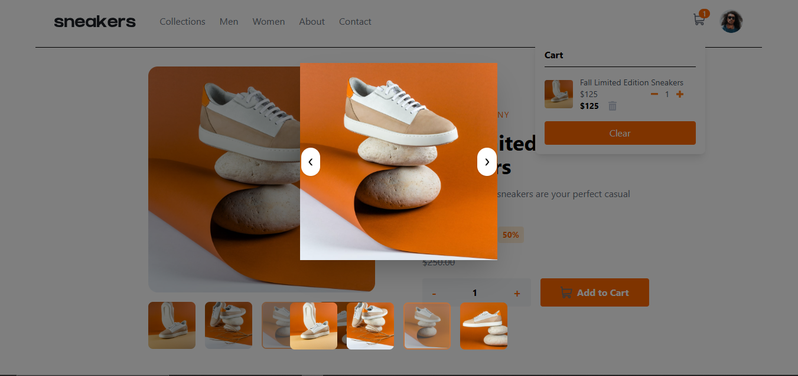
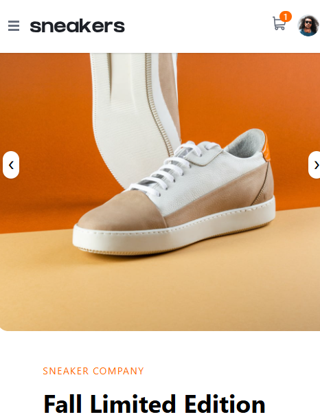
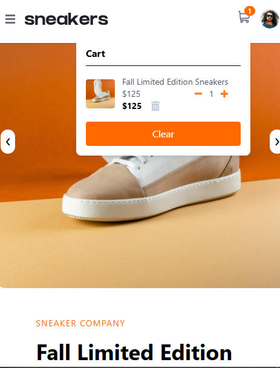

🛒 E-Commerce Product Page

A modern, responsive E-commerce product page built with React, TypeScript, and Redux Toolkit.
This project demonstrates real-world frontend architecture including state management, UI interactions, and clean component structure.

---

🚀 Live Demo

---

📸 Screenshots

💻 Desktop

📱 Mobile

Add screenshot here

---

✨ Features

- 🖼️ Interactive product image gallery (with preview & navigation)
- ➕ Add to cart with dynamic quantity
- 🛒 Cart system with:
  - Real-time updates
  - Total price calculation
  - Item quantity tracking
  - Clear cart functionality
- 📊 Cart badge in Navbar (live count)
- 📦 Cart dropdown with full item details
- 📱 Fully responsive design (Mobile & Desktop)
- ⚡ Clean and optimized state management using Redux Toolkit

---

🧠 What I Focused On

- Building a realistic cart system (not just UI)
- Applying Redux Toolkit correctly (single source of truth)
- Separating UI state vs global state
- Writing clean, scalable, and reusable code
- Following best practices in TypeScript and React

---

🧩 Tech Stack

- ⚛️ React
- 🟦 TypeScript
- 🧠 Redux Toolkit
- 🎨 Tailwind CSS

---

📁 Project Structure

src/
├── components/ # Reusable UI components
├── store/ # Redux slices & store config
├── hooks/ # Custom hooks (useCart, etc.)
├── assets/ # Images & static files
└── App.tsx

---

⚙️ Installation & Setup

# Clone the repo

git clone https://github.com/ahmedmostafa-io/E-Commerce-Product-Page.git

# Go into the project

cd your-repo-name

# Install dependencies

npm install

# Run the project

npm run dev

---

🎯 Key Concepts Demonstrated

- State management with Redux Toolkit
- Derived data using ".reduce()"
- Component composition & separation of concerns
- Custom hooks for cleaner logic reuse
- Responsive UI with Tailwind CSS

---

🔥 Future Improvements

- 🗑️ Remove individual items from cart
- 💾 Persist cart data (localStorage)
- 🎬 Add animations for better UX
- 🔐 Authentication & user system

---

👨‍💻 Author

Ahmed Mostafa

- GitHub: https://github.com/ahmedmostafa-io
- LinkedIn: Add your LinkedIn link

---

⭐ If you like this project

Give it a star ⭐ on GitHub — it helps a lot!
